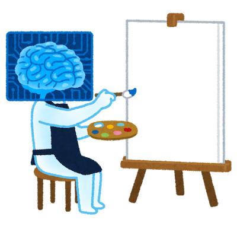
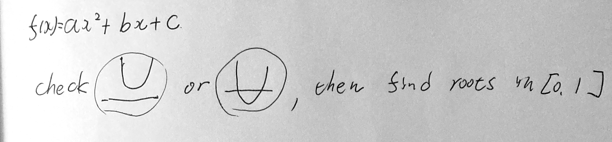
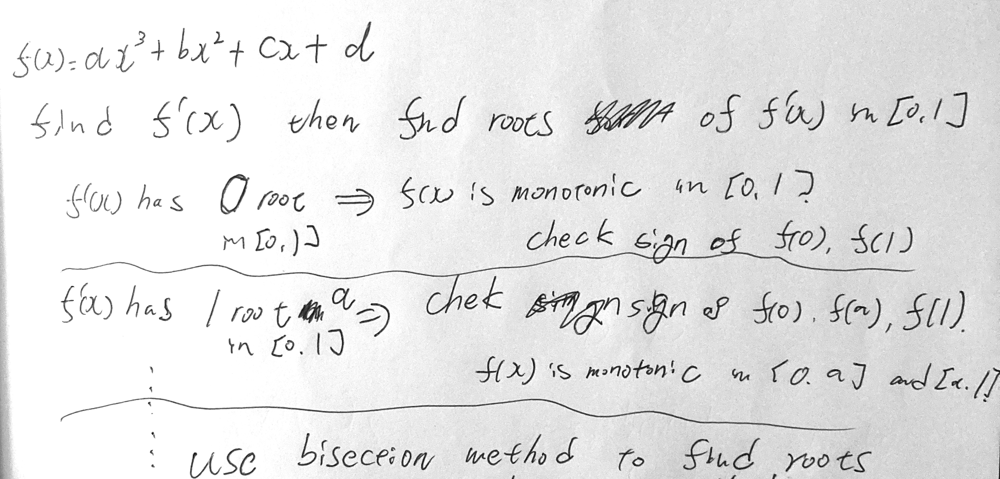
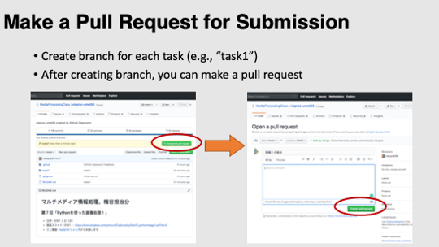

# Task02: Rasterization of Parametric Curves

**Deadline: May 11 (Mon) at 15:00pm**


This is the blurred preview of the expected result:


When you execute the program, it will output an PNG image file (`output.png`) replacing the image below. Try making the image below and the image above look similar after doing the assignment.



----

## Instruction

Please follow this instruction to prepare the environment to do the assignment 

If you had some trouble with `git` in the local repository in the previous assignment, `clone` your remote repository again to avoid trouble.

```bash
$ git clone https://github.com/ACG-2026S/acg-<username>.git
```


Go to the top of the local repository

```bash
$ cd acg-<username>     # go to the local repository
```

### Update Local Repository

Update the local repository on your computer

```bash
$ git checkout main   # set main branch as the current branch
$ git fetch origin main    # download the main branch from remote repository
$ git reset --hard origin/main  # reset the local main branch same as remote repository
```

After this command, you will see the local repository is synced with the remote repository at `https://github.com/ACG-2026S/acg-<username>`

### Create a Branch

To do this assignment, you need to be in the branch `task02`.  
You can always check your the current branch by

```bash
$ git branch -a   # list all branches, showing the current branch 
```

You are probably in the `main` branch. Let's create the `task02` branch and set it as the current branch.

```bash
$ git branch task02   # create task0 branch
$ git checkout task02  # switch into the task02 branch
$ git branch -a   # make sure you are in the task02 branch
```

The environment is ready. 

## Problem1

Next, compile the code with the following command:
```bash
$ cd task02  # you are in "acg-<username>/task02" directory
$ cargo run --release
```

Now you will see the `output.png` is create. The `output.png` will show an angular shape of the letter **R**. Now let's write a program to make the font shape smooth as the original one.


## Problem2

The code you compiled above uses the ***Jordan's curve theorem** to find whether the center of a pixel is inside or outside the character. The code counts the number of intersections of a ray against the boundary.
The boundary of the letter is represented by sequences of line segments and quadratic Bézier curves. The Problem1's output was angular because the Bézier curve was approximated as a line segment.

Modify the code `main.rs` around line #27 and line #104 to compute the number of intersections of a ray against the Bézier curve. The output will be the letter ***R*** with smooth boundary.

Follow the instruction below to find the roots for quadratic function




## Problem3

For pixel outside the letter R, we compute the minimal distance to the boundary. Modify the code `main.rs` around line #54 and #140.

Follow the instruction below to find the roots for a cubic function



### Submit

Before submitting a pull request, neat up the code by fixing the problem pointed out by linter.  
```bash
cargo clippy
```

Make your code formated by the following command

```bash
cargo fmt
```

Finally, you submit the document by pushing to the `task02` branch of the remote repository. 

```bash
cd acg-<username>    # go to the top of the repository
git status  # check the changes
git add .   # stage the changes
git status  # check the staged changes
git commit -m "task02 finished"   # the comment can be anything
git push --set-upstream origin task02  # update the task02 branch of the remote repository
```

got to the GitHub webpage `https://github.com/ACG-2026S/acg-<username>`. 
If everything looks good on this page, make a pull request. 




----

## Reference

- Coding Adventure: Rendering Text
  : https://www.youtube.com/watch?v=SO83KQuuZvg

- SIGGRAPH 2022 Talk - A Fast & Robust Solution for Cubic & Higher-Order Polynomials by Cem Yuksel: https://www.youtube.com/watch?v=ok0EZ0fBCMA

- True Type: https://en.wikipedia.org/wiki/TrueType
