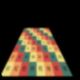
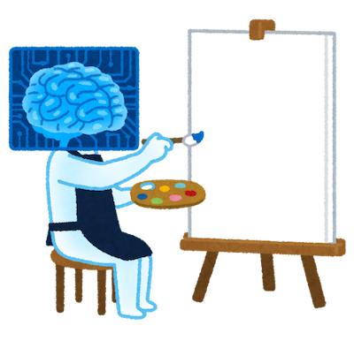
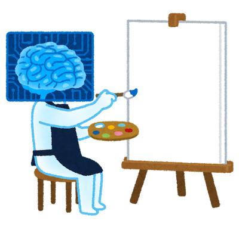
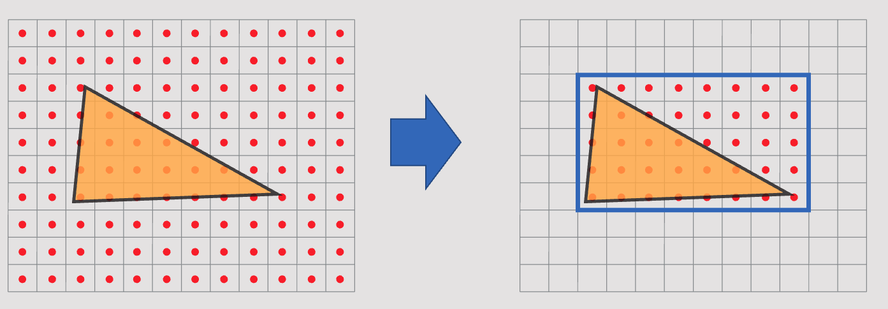

# Task03: Perspective-Correct Texture Mapping

**Deadline: May. 15th (Fri) at 15:00pm**

This is the blurred preview of the expected result:




When you execute the program, it will output PNG image files (output1.png and output 2.png) replacing the image below. Try making the image below and the image above look similar after doing the assignment. 




----

## Before doing the assignment

Follow the instruction same as `task01` and `task02` to submit the assignment. In a nutshell, before doing the assignment,
- make sure you synchronized the main  branch of your local repository to that of remote repository.
- make sure you created branch `task03` from main branch.
- make sure you are currently in the `task03` branch (use git branch -a command).

The command will be like below

```bash
$ cd acg-<username>  # go to the local repository
$ git checkout main  # set main branch as the current branch
$ git fetch origin main    # download the main branch from remote repository
$ git reset --hard origin/main  # reset the local main branch same as remote repository
$ git branch -a   # make sure you are in main branch
$ git branch task03   # create task03 branch from main branch
$ git checkout task03  # switch into the task03 branch
$ git branch -a   # make sure you are in the task03 branch
```

Now you are ready to go!

### Problem 1

Compile the code with 

``` bash
$ cd task03  # you are in "acg-<username>/task03" directory
$ cargo run --release # configure Release mode for fast execution
```

Now you will see the `output1.png` is updated.
The code you run shows the texture mapping is wrongly computed, and thus you see unnatural distortion of the texture.
This is because the UV coordinates is interpolated using the ***Barycentric coordinate on the screen*** ignoring the perspective effect.
Instead, we need to compute the ***Barycentric coordinate on the object*** to correctly interpolate the corner point's UV coordinates.

Edit the code around `line 93` of `src/raster.rs` to implement perspective correct interpolation.  

### Problem 2

Let's draw a triangle mesh by removing the comment out in `src/main.rs` at `line #10`. 
You can run the code again by 

```bash
$ cd task03  # you are in "acg-<username>/task03" directory
$ cargo run --release # configure Release mode for fast execution
```
This program output `output2.png`, but currently the program is slow and the occlusion is not correctly handled.
Write some codes around `line 61` in `src/raster.rs` to implement acceleration as the figure below.



The program output number of total in/out tests in the standard output. Write down the number below.

| in/out test before | in/out test after |
|--------------------|-------------------|
| ???                | ???               |

Then, write some code to compute the order of triangle rasterization, from far triangle to near.
Sort the triangle order by looking at it center of gravity's z-coordinate in NDC.
Write simple one line code (using Rust's default sort function) around `line 83` in `src/problem2.rs` . 

### Submit

Before submitting a pull request, neat up the code by fixing the problem pointed out by linter.
```bash
cargo clippy
```

Make your code formated by the following command

```bash
cargo fmt
```

Finally, you submit the document by pushing to the `task03` branch of the remote repository. 

```bash
cd acg-<username>    # go to the top of the repository
git status  # check the changes
git add .   # stage the changes
git status  # check the staged changes
git commit -m "task03 finished"   # the comment can be anything
git push --set-upstream origin task03  # up date the task03 branch of the remote repository
```

got to the GitHub webpage `https://github.com/ACG-2024S/acg-<username>`. If everything looks good on this page, make a pull request. 


## Reference

- [Perspective Projection and Texture Mapping (by Keenan Crane)](https://www.youtube.com/watch?v=_4Q4O2Kgdo4)
- [Texture Mapping](https://en.wikipedia.org/wiki/Texture_mapping)
